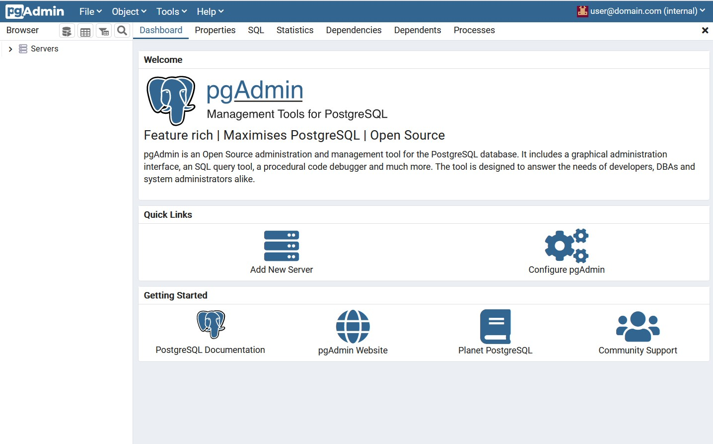

# Description

This repository contains a docker-compose configuration to start `pgadmin` application.

pgAdmin 4 is a web based administration tool for the PostgreSQL database.

# Quick Start

You may adapt configuration via environment

- PGADMIN_DEFAULT_EMAIL
- PGADMIN_DEFAULT_PASSWORD

Further environment variables are described at https://www.pgadmin.org/docs/pgadmin4/development/container_deployment.html

After start browse to `http://localhost:8080` and use login credentials specified in 
`PGADMIN_DEFAULT_EMAIL` and `PGADMIN_DEFAULT_PASSWORD`.

# Health Check

Shortly after start of container you will notice the `status: health` is still showing
`starting`. If you expected the value `healthy` showing there check parameters of 
healthcheck command. Because the health check is performed each `interval`. So at
first start the status is showing `starting`. After next health check its value should
switch to `healthy`.

Starting

```
$ docker ps
CONTAINER ID   IMAGE                 COMMAND            CREATED         STATUS                           PORTS                           NAMES
1fa923b7b4d4   dpage/pgadmin4:6.18   "/entrypoint.sh"   2 seconds ago   Up 1 second (health: starting)   443/tcp, 0.0.0.0:8080->80/tcp   pgadmin
```

Healthy

```
$ docker ps
CONTAINER ID   IMAGE                 COMMAND            CREATED         STATUS                   PORTS                           NAMES
1fa923b7b4d4   dpage/pgadmin4:6.18   "/entrypoint.sh"   2 minutes ago   Up 2 minutes (healthy)   443/tcp, 0.0.0.0:8080->80/tcp   pgadmin
```

# Screenshot



# Reference

- https://hub.docker.com/r/dpage/pgadmin4/
- https://www.pgadmin.org
- https://www.pgadmin.org/docs/pgadmin4/development/container_deployment.html